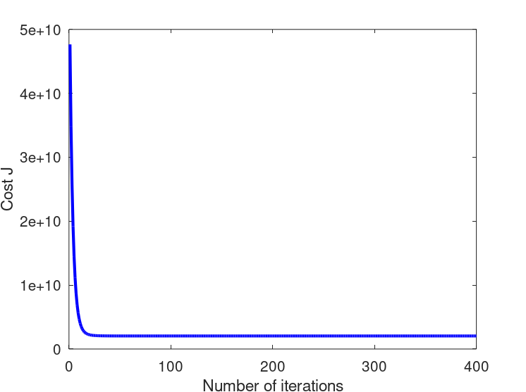

# Linear regression with multiple variables

In this part, you will implement linear regression with multiple variables to predict the prices of houses. Suppose you are selling your house and you want to know what a good market price would be. One way to do this is to first collect information on recent houses sold and make a model of housing prices.

The file `ex1data2.txt` contains a training set of housing prices in Portland, Oregon. The first column is the size of the house (in square feet), the second column is the number of bedrooms, and the third column is the price of the house.

The `ex1 multi.m` script has been set up to help you step through this exercise.

## Feature Normalization

The `ex1_multi.m` script will start by loading and displaying some values from this dataset. By looking at the values, note that house sizes are about 1000 times the number of bedrooms. When features differ by orders of magnitude, first performing feature scaling can make gradient descent converge much more quickly.

Your task here is to complete the code in `featureNormalize.m` to,
- Subtract the mean value of each feature from the dataset.
- After subtracting the mean, additionally scale (divide) the feature values by their respective “standard deviations”.

The standard deviation is a way of measuring how much variation there is in the range of values of a particular feature (most data points will lie within ±2 standard deviations of the mean); this is an alternative to taking the range of values (max-min). In Octave/MATLAB, you can use the “std” function to compute the standard deviation. For example, inside `featureNormalize.m`, the quantity `X(:,1)` contains all the values of `x1` (house sizes) in the training set, so `std(X(:,1))` computes the standard deviation of the house sizes. At the time that `featureNormalize.m` is called, the extra column of 1’s corresponding to  has not yet been added to `X`. You will do this for all the features and your code should work with datasets of all sizes (any number of features / examples).

## Gradient Descent

Previously, you implemented gradient descent on a univariate regression problem. The only difference now is that there is one more feature in the matrix `X`. The hypothesis function and the batch gradient descent update rule remain unchanged. You should complete the code in `computeCostMulti.m` and `gradientDescentMulti.m` to implement the cost function and gradient descent for linear regression with multiple variables. If your code in the previous part (single variable) already supports multiple variables, you can use it here too. Make sure your code supports any number of features and is well-vectorized. You can use `size(X, 2)` to find out how many features are present in the dataset.

### Selecting learning rates

In this part of the exercise, you will get to try out different learning rates for the dataset and find a learning rate that converges quickly. You can change the learning rate by modifying `ex1_multi.m` and changing the part of the code that sets the learning rate. The next phase in `ex1_multi.m` will call your `gradientDescent.m` function and run gradient descent for about 50 iterations at the chosen learning rate. The function should also return the history of J(θ) values in a vector J. After the last iteration, the `ex1_multi.m` script plots the J values against the number of the iterations. If you picked a learning rate within a good range, your plot look similar Figure 1.

Figure 1: Convergence of gradient descent with an appropriate learning rate

If your graph looks very different, especially if your value of  increases or even blows up, adjust your learning rate and try again. We recommend trying values of the learning rate α on a log-scale, at multiplicative steps of about 3 times the previous value (i.e., 0.3, 0.1, 0.03, 0.01 and so on). You may also want to adjust the number of iterations you are running if that will help you see the overall trend in the curve.

Notice the changes in the convergence curves as the learning rate changes. With a small learning rate, you should find that gradient descent takes a very long time to converge to the optimal value. Conversely, with a large learning rate, gradient descent might not converge or might even diverge!

Using the best learning rate that you found, run the `ex1 multi.m` script to run gradient descent until convergence to find the final values of `θ`. Next, use this value of `θ` to predict the price of a house with 1650 square feet and 3 bedrooms. You will use value later to check your implementation of the normal equations. Don’t forget to normalize your features when you make this prediction!

## Normal Equations

In the lecture videos, you learned that the closed-form solution to linear regression is,

Using this formula does not require any feature scaling, and you will get an exact solution in one calculation. There is no “loop until convergence” like in gradient descent. 

Complete the code in `normalEqn.m` to use the formula above to calculate `θ`. Remember that while you don’t need to scale your features, we still need to add a column of 1’s to the `X` matrix to have an intercept term (). The code in `ex1.m` will add the column of 1’s to `X` for you.

Once you have found `θ` using this method, use it to make a price prediction for a 1650-square-foot house with 3 bedrooms. You should find that gives the same predicted price as the value you obtained using the model fit with gradient descent.