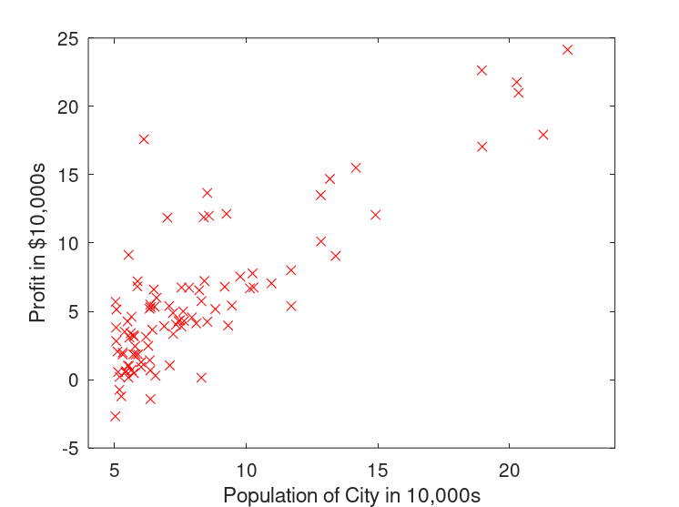
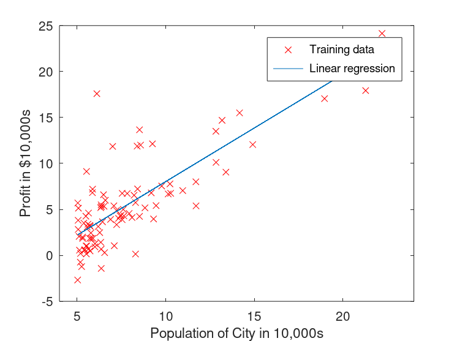
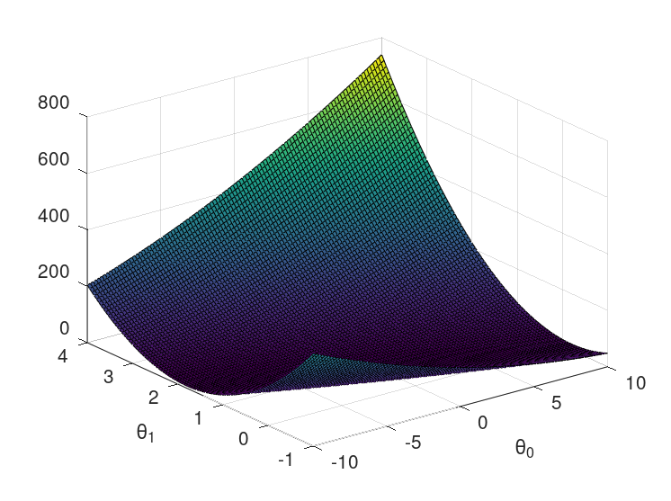
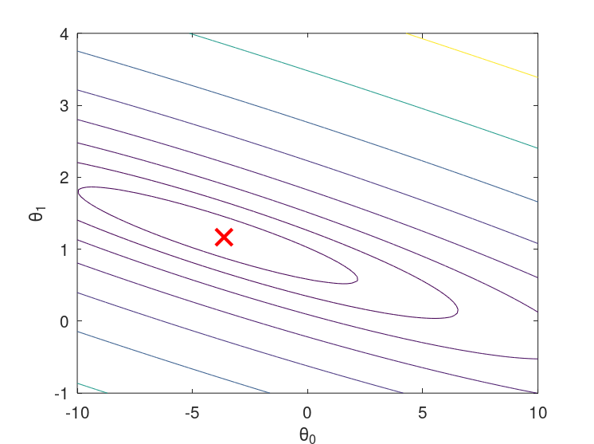

# Linear regression with one variable

In this part of this exercise, you will implement linear regression with one variable to predict profits for a food truck. Suppose you are the CEO of a restaurant franchise and are considering different cities for opening a new outlet. The chain already has trucks in various cities and you have data for profits and populations from the cities.

You would like to use this data to help you select which city to expand to next.

The file `ex1data1.txt` contains the dataset for our linear regression problem. The first column is the population of a city and the second column is the profit of a food truck in that city. A negative value for profit indicates a loss.

The `ex1.m` script has already been set up to load this data for you.

## Plotting the Data

Before starting on any task, it is often useful to understand the data by visualizing it. For this dataset, you can use a scatter plot to visualize the data, since it has only two properties to plot (profit and population). (Many other problems that you will encounter in real life are multi-dimensional and can’t be plotted on a 2-d plot).

In `ex1.m`, the dataset is loaded from the data file into the variables `X` and `y`:

```matlab
data = load('ex1data1.txt');       % read comma separated data
X = data(:, 1);
y = data(:, 2);
m = length(y);                     % number of training examples
```

Next, the script calls the `plotData` function to create a scatter plot of the data. Your job is to complete `plotData.m` to draw the plot; modify the file and fill in the following code:

```matlab
plot(x, y, 'rx', 'MarkerSize', 10);          % Plot the data
ylabel('Profit in $10,000s');                % Set the y−axis label
xlabel('Population of City in 10,000s');     % Set the x−axis label
```

Now, when you continue to run `ex1.m`, our end result should look like Figure 1, with the same red “x” markers and axis labels.

<figure align="center">

<figcaption>Figure 1: Scatter plot of training data</figcaption>
</figure>

## Gradient Descent

In this part, you will fit the linear regression parameters `θ` to our dataset using gradient descent.

### Update Equations

The objective of linear regression is to minimize the cost function,


where the hypothesis  is given by the linear model,


<br>

Recall that the parameters of your model are the  values. These are the values you will adjust to minimize cost `J(θ)`. One way to do this is to use the batch gradient descent algorithm. In batch gradient descent, each iteration performs the update,

 (simultaneously update  for all `j`).

With each step of gradient descent, your parameters  come closer to the optimal values that will achieve the lowest cost `J(θ)`.

### Implementation

In `ex1.m`, we have already set up the data for linear regression. In the following lines, we add another dimension to our data to accommodate the  intercept term. We also initialize the initial parameters to 0 and the learning rate alpha to 0.01.

```matlab
X = [ones(m, 1), data(:,1)];     % Add a column of ones to x
theta = zeros(2, 1);             % initialize fitting parameters

iterations = 1500;
alpha = 0.01;
```

### Computing the cost `J(θ)`

As you perform gradient descent to learn minimize the cost function `J(θ)`, it is helpful to monitor the convergence by computing the cost. In this section, you will implement a function to calculate `J(θ)` so you can check the convergence of your gradient descent implementation.

Your next task is to complete the code in the file `computeCost.m`, which is a function that computes `J(θ)`. As you are doing this, remember that the variables `X` and `y` are not scalar values, but matrices whose rows represent the examples from the training set. Once you have completed the function, the next step in `ex1.m` will run `computeCost` once using `θ` initialized to zeros, and you will see the cost printed to the screen.

You should expect to see a cost of 32.07.

### Gradient descent

Next, you will implement gradient descent in the file `gradientDescent.m`. The loop structure has been written for you, and you only need to supply the updates to `θ` within each iteration.

As you program, make sure you understand what you are trying to optimize and what is being updated. Keep in mind that the cost `J(θ)` is parameterized by the vector `θ`, not `X` and `y`. That is, we minimize the value of `J(θ)` by changing the values of the vector `θ`, not by changing `X` or `y`.

A good way to verify that gradient descent is working correctly is to look at the value of `J(θ)` and check that it is decreasing with each step. The starter code for `gradientDescent.m` calls `computeCost` on every iteration and prints the cost. Assuming you have implemented gradient descent and `computeCost` correctly, your value of `J(θ)` should never increase, and should converge to a steady value by the end of the algorithm.

After you are finished, `ex1.m` will use your final parameters to plot the linear fit. The result should look something like Figure 2,


Figure 2: Training data with linear regression fit

Your final values for `θ` will also be used to make predictions on profits in areas of 35,000 and 70,000 people. Note the way that the following lines in `ex1.m` uses matrix multiplication, rather than explicit summation or looping, to calculate the predictions. This is an example of code vectorization in Octave/MATLAB.

```matlab
predict1 = [1, 3.5] * theta;
predict2 = [1, 7] * theta;
```

## Visualizing `J(θ)`

To understand the cost function `J(θ)` better, you will now plot the cost over a 2-dimensional grid of  and  values. You will not need to code anything new for this part, but you should understand how the code you have written already is creating these images.

In the next step of `ex1.m`, there is code set up to calculate `J(θ)` over a grid of values using the `computeCost` function.

```matlab
% initialize J_vals to a matrix of 0's
J_vals = zeros(length(theta0_vals), length(theta1_vals));

% Fill out J_vals
for i = 1:length(theta0_vals)
    for j = 1:length(theta1_vals)
        t = [theta0_vals(i); theta1_vals(j)];
        J_vals(i,j) = computeCost(x, y, t);
    end
end
```

After these lines are executed, you will have a 2-D array of `J(θ)` values. The script `ex1.m` will then use these values to produce surface and contour plots of `J(θ)` using the surf and contour commands and the plots should look something like Figure 3 and Figure 4, respectively,




Figure 3: Surface plot of `J(θ)`




Figure 4: Contour plot of `J(θ)`

The purpose of these graphs is to show you that how `J(θ)` varies with changes in  and . The cost function `J(θ)` is bowl-shaped and has a global mininum. This minimum is the optimal point for  and , and each step of gradient descent moves closer to this point.